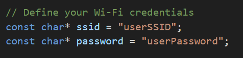
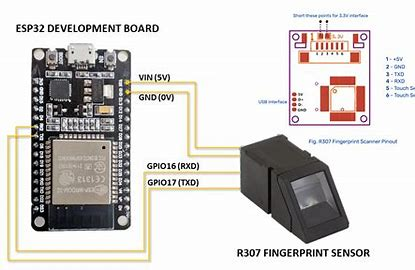
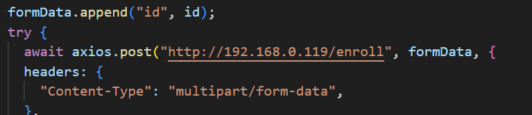
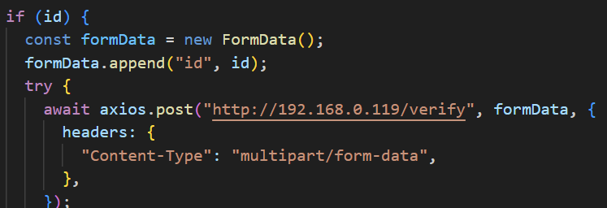
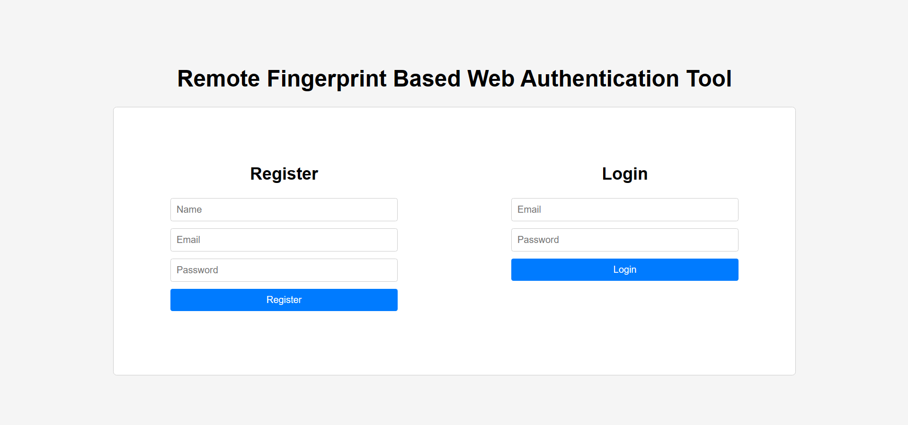

# Remote Fingerprint Based Web Authentication Tool

It uses ESP32 as a webserver to handle the Authentication request for Enrollment of new user & authication of existing user. The node js server is used for frontend and backend of the web application, which uses a simple setup and routing with error handlings.

Fingerprint Sensor: R307
MC: ESP32 Dev Module

*Installation & Setup:*

1) ESP32 & R307

- Upload the code (main.ino) to the ESP32

- Change the ssid & password accordingly

- Follow the Wiring accordingly

2) Node Web App

- Get the IP of the ESP32 via Fing / Any such tools and replace it in the server.js in two routes

- In Terminal (of Current project folder)

  npm i
  (To Install node modules & dependent packages)

  node server.js
  (To start the Web App)

Note:
There are two other routes to Get all stored fingerprints & Clear all fingerprints
Which can be executed via Postman / Browser / other such tools.
 - /clear
 - /list

